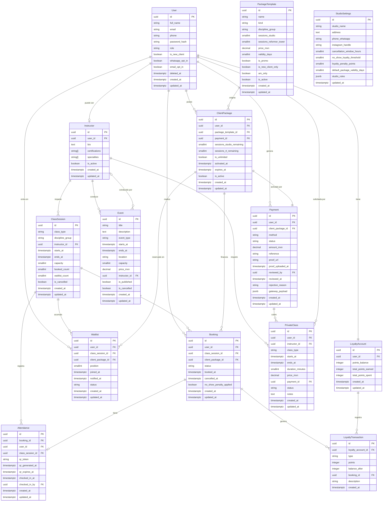

# Alma Movement — Modelo de Datos (DATA-MODEL)

> Documento técnico de referencia. Fecha: 2026-06-06.
> Fuente de verdad: especificaciones del cliente + glosario canónico.
> Este documento NO debe publicarse en repositorios públicos sin censurar la sección de datos de transferencia bancaria (usar variables de entorno).

---

## Índice

1. [Convenciones generales](#1-convenciones-generales)
2. [Enumeraciones canónicas](#2-enumeraciones-canónicas)
3. [Catálogo de entidades](#3-catálogo-de-entidades)
   - 3.1 User
   - 3.2 Instructor
   - 3.3 ClassSession
   - 3.4 Booking
   - 3.5 Waitlist
   - 3.6 PackageTemplate
   - 3.7 ClientPackage
   - 3.8 Payment
   - 3.9 Attendance (CheckIn QR)
   - 3.10 LoyaltyAccount
   - 3.11 LoyaltyTransaction
   - 3.12 Event
   - 3.13 PrivateClass
   - 3.14 StudioSettings
4. [Reglas de negocio críticas](#4-reglas-de-negocio-críticas)
5. [Diagrama ER (Mermaid)](#5-diagrama-er-mermaid)
6. [Preguntas abiertas](#6-preguntas-abiertas)

---

## 1. Convenciones generales

| Convención | Detalle |
|---|---|
| Identificadores | UUID v4 en todas las entidades (columna `id`) |
| Fechas/tiempos | `TIMESTAMPTZ` (con zona horaria, zona local: `America/Mexico_City`) |
| Moneda | `DECIMAL(10,2)` en MXN; sin conversión de divisas en este alcance |
| Soft delete | Columna `deleted_at TIMESTAMPTZ NULL` en entidades que lo requieran |
| Auditoría | `created_at` y `updated_at` en todas las entidades |
| Texto sensible | Datos bancarios NUNCA en la base de datos de aplicación; se leen desde variables de entorno / gestor de secretos |
| Nomenclatura | Inglés para nombres de entidades, campos y enums (per glosario canónico); español solo en copy de UI |

---

## 2. Enumeraciones canónicas

### ClassType
Disciplina específica de una clase.

| Valor | Descripción |
|---|---|
| `REFORMER` | Pilates en máquina Reformer |
| `TOWER` | Pilates en máquina Tower |
| `MAT` | Pilates en colchoneta |
| `BARRE` | Barre |
| `SCULPT` | Sculpt |

### DisciplineGroup
Agrupación comercial de disciplinas para efectos de paquetes.

| Valor | Disciplinas incluidas |
|---|---|
| `STUDIO` | MAT, BARRE, SCULPT |
| `REFORMER_TOWER` | REFORMER, TOWER |
| `ALL` | REFORMER, TOWER, MAT, BARRE, SCULPT |

### PackageKind
Tipo de paquete de sesiones.

| Valor | Descripción |
|---|---|
| `SINGLE` | Clase única (1 sesión) |
| `PACK` | Paquete de N sesiones (4, 8 o 12) |
| `UNLIMITED` | Sesiones ilimitadas en el periodo de vigencia |
| `INTRO` | Clase muestra, solo nuevos usuarios, 7 días |
| `MIXED` | Combinación de sesiones Studio + ReformerTower (BALANCE, FUSION, EXPERIENCE) |
| `AM_CLUB` | Paquete exclusivo turno matutino (7am–10am) |

### BookingStatus
Estado de una reserva.

| Valor | Descripción |
|---|---|
| `RESERVED` | Reserva activa y confirmada |
| `ATTENDED` | Cliente asistió y se registró el check-in |
| `NO_SHOW` | Cliente no asistió; la sesión se consume |
| `CANCELLED` | Reserva cancelada dentro de la ventana permitida (>12 h antes) |
| `WAITLISTED` | En lista de espera; sin cupo confirmado aún |

### PaymentStatus
Estado de un pago.

| Valor | Descripción |
|---|---|
| `PENDING` | Pendiente de acción del cliente |
| `AWAITING_PROOF` | Cliente seleccionó transferencia; se espera comprobante |
| `CONFIRMED` | Pago validado (manual o automático) |
| `REJECTED` | Comprobante rechazado o pago fallido |

### PaymentMethod
Método de pago utilizado.

| Valor | Descripción |
|---|---|
| `ONLINE` | Pago en línea (pasarela de cobro) |
| `TRANSFER` | Transferencia bancaria (validación manual de comprobante) |
| `CASH` | Efectivo en el estudio |

---

## 3. Catálogo de entidades

---

### 3.1 User

Representa a toda persona con cuenta en el sistema: clientas, administradoras e instructoras. El rol determina los permisos.

| Campo | Tipo | Notas |
|---|---|---|
| `id` | UUID | PK |
| `full_name` | VARCHAR(120) | Nombre completo |
| `email` | VARCHAR(254) | Único, índice, validado |
| `phone` | VARCHAR(20) | WhatsApp principal; formato internacional (+52...) |
| `password_hash` | VARCHAR(255) | Bcrypt / Argon2; nunca se almacena en texto plano |
| `role` | ENUM(`CLIENT`, `INSTRUCTOR`, `ADMIN`) | Rol en el sistema |
| `avatar_url` | VARCHAR(500) | URL pública de foto de perfil |
| `birth_date` | DATE | Opcional; para cumpleaños / segmentación |
| `medical_notes` | TEXT | Lesiones o condiciones médicas declaradas |
| `is_new_client` | BOOLEAN | `true` hasta que consume su primer paquete no-INTRO |
| `whatsapp_opt_in` | BOOLEAN | Consentimiento para notificaciones por WhatsApp |
| `email_opt_in` | BOOLEAN | Consentimiento para notificaciones por correo |
| `deleted_at` | TIMESTAMPTZ | Soft delete |
| `created_at` | TIMESTAMPTZ | Registro de alta |
| `updated_at` | TIMESTAMPTZ | Última modificación |

**Relaciones:**
- Un `User` con `role = CLIENT` puede tener muchos `ClientPackage`, `Booking`, `Payment` y un `LoyaltyAccount`.
- Un `User` con `role = INSTRUCTOR` está asociado a `ClassSession` y `PrivateClass`.

---

### 3.2 Instructor

Perfil extendido de un usuario con `role = INSTRUCTOR`. Separado para mantener información específica del instructor sin mezclarla con el perfil de clienta.

| Campo | Tipo | Notas |
|---|---|---|
| `id` | UUID | PK |
| `user_id` | UUID | FK → `User.id`, único (1:1) |
| `bio` | TEXT | Descripción profesional visible en la app |
| `certifications` | TEXT[] | Arreglo de certificaciones (ej. "STOTT Pilates", "Basi") |
| `specialties` | `ClassType`[] | Disciplinas que imparte |
| `instagram_handle` | VARCHAR(60) | Perfil de Instagram del instructor (opcional) |
| `is_active` | BOOLEAN | Si puede ser asignado a clases |
| `created_at` | TIMESTAMPTZ | |
| `updated_at` | TIMESTAMPTZ | |

**Relaciones:**
- Un `Instructor` puede estar asignado a múltiples `ClassSession`.
- Un `Instructor` puede impartir múltiples `PrivateClass`.

---

### 3.3 ClassSession

Instancia concreta de una clase: fecha, hora, disciplina, instructor y capacidad disponible. Es el corazón del sistema de reservas.

| Campo | Tipo | Notas |
|---|---|---|
| `id` | UUID | PK |
| `class_type` | `ClassType` | Disciplina: REFORMER, TOWER, MAT, BARRE, SCULPT |
| `discipline_group` | `DisciplineGroup` | Derivado de `class_type`; para validación de paquetes |
| `instructor_id` | UUID | FK → `Instructor.id` |
| `starts_at` | TIMESTAMPTZ | Fecha y hora de inicio (ej. 2026-06-10T06:00:00-06:00) |
| `ends_at` | TIMESTAMPTZ | Fecha y hora de fin |
| `capacity` | SMALLINT | Cupos totales: REFORMER=4, TOWER=4, Studio=TBD |
| `booked_count` | SMALLINT | Cupos confirmados (calculado / mantenido por trigger) |
| `waitlist_count` | SMALLINT | Posiciones en espera activas |
| `is_cancelled` | BOOLEAN | La sesión fue cancelada por el estudio |
| `cancel_reason` | TEXT | Motivo de cancelación por parte del estudio |
| `location_notes` | TEXT | Sala o equipo específico (ej. "Reformer 1–4") |
| `created_at` | TIMESTAMPTZ | |
| `updated_at` | TIMESTAMPTZ | |

**Notas de negocio:**
- `booked_count` se incrementa al crear un `Booking` con estado `RESERVED` y se decrementa al cambiar a `CANCELLED`.
- El campo `discipline_group` se deduce automáticamente: `{REFORMER, TOWER}` → `REFORMER_TOWER`; `{MAT, BARRE, SCULPT}` → `STUDIO`.
- Horarios válidos: 6:00am–11:00am y 5:00pm–8:00pm.

**Relaciones:**
- Una `ClassSession` tiene muchos `Booking` y muchos `Waitlist`.
- Una `ClassSession` pertenece a un `Instructor`.

---

### 3.4 Booking

Reserva de una clienta para una `ClassSession` específica. Vincula a la clienta con la sesión y con el `ClientPackage` del que se descuenta la sesión.

| Campo | Tipo | Notas |
|---|---|---|
| `id` | UUID | PK |
| `user_id` | UUID | FK → `User.id` |
| `class_session_id` | UUID | FK → `ClassSession.id` |
| `client_package_id` | UUID | FK → `ClientPackage.id`; paquete del que se descuenta |
| `status` | `BookingStatus` | RESERVED / ATTENDED / NO_SHOW / CANCELLED / WAITLISTED |
| `booked_at` | TIMESTAMPTZ | Momento en que se realizó la reserva |
| `cancelled_at` | TIMESTAMPTZ | Momento de cancelación (NULL si no aplica) |
| `cancel_reason` | TEXT | Razón de cancelación (opcional, ingresada por la clienta) |
| `no_show_penalty_applied` | BOOLEAN | Indica si ya se aplicó penalización de lealtad por este no-show |
| `created_at` | TIMESTAMPTZ | |
| `updated_at` | TIMESTAMPTZ | |

**Restricción de unicidad:** `(user_id, class_session_id)` — una clienta no puede tener dos reservas activas para la misma sesión.

**Notas de negocio:**
- Al crear el `Booking` en estado `RESERVED`, se descuenta 1 sesión del `ClientPackage` correspondiente (ver Sección 4).
- Si el estado cambia a `CANCELLED` con `>= 12 horas` antes del inicio, la sesión se devuelve al `ClientPackage`.
- Si el estado es `NO_SHOW`, la sesión no se reembolsa. Se registra en `LoyaltyTransaction` si corresponde penalización.

**Relaciones:**
- Un `Booking` pertenece a un `User`, una `ClassSession` y un `ClientPackage`.
- Un `Booking` puede tener un `Attendance`.

---

### 3.5 Waitlist

Lista de espera para una `ClassSession` sin cupos disponibles. Cuando se libera un cupo, se notifica a la primera persona en la lista.

| Campo | Tipo | Notas |
|---|---|---|
| `id` | UUID | PK |
| `user_id` | UUID | FK → `User.id` |
| `class_session_id` | UUID | FK → `ClassSession.id` |
| `client_package_id` | UUID | FK → `ClientPackage.id`; paquete a usar si se confirma |
| `position` | SMALLINT | Posición en la lista (1 = primero) |
| `joined_at` | TIMESTAMPTZ | Momento de ingreso a la lista |
| `notified_at` | TIMESTAMPTZ | Cuando se envió la notificación de cupo disponible |
| `expired_at` | TIMESTAMPTZ | Si la clienta no confirmó en el tiempo límite |
| `status` | ENUM(`WAITING`, `NOTIFIED`, `CONVERTED`, `EXPIRED`, `REMOVED`) | Estado actual en la lista |
| `created_at` | TIMESTAMPTZ | |
| `updated_at` | TIMESTAMPTZ | |

**Notas de negocio:**
- `CONVERTED`: la clienta fue promovida; se creó un `Booking` a partir de esta entrada.
- `EXPIRED`: la clienta fue notificada pero no confirmó en el tiempo límite (TBD, ver Preguntas abiertas).
- Al convertirse, la sesión se descuenta del `client_package_id` señalado.

**Restricción de unicidad:** `(user_id, class_session_id)` donde `status = WAITING`.

---

### 3.6 PackageTemplate

Catálogo maestro de paquetes disponibles para la venta. Define las reglas comerciales de cada producto.

| Campo | Tipo | Notas |
|---|---|---|
| `id` | UUID | PK |
| `name` | VARCHAR(100) | Nombre comercial (ej. "ALMA BALANCE") |
| `kind` | `PackageKind` | SINGLE / PACK / UNLIMITED / INTRO / MIXED / AM_CLUB |
| `discipline_group` | `DisciplineGroup` | Grupo de disciplinas válidas para este paquete |
| `sessions_studio` | SMALLINT | Sesiones Studio incluidas (NULL si UNLIMITED o no aplica) |
| `sessions_reformer_tower` | SMALLINT | Sesiones Reformer/Tower incluidas (NULL si UNLIMITED o no aplica) |
| `sessions_total` | SMALLINT | Total de sesiones (calculado: sessions_studio + sessions_reformer_tower) |
| `price_mxn` | DECIMAL(10,2) | Precio en MXN |
| `validity_days` | SMALLINT | Días de vigencia desde la activación (7, 30 o 45) |
| `is_promo` | BOOLEAN | Indica si es precio de promoción de apertura |
| `is_new_client_only` | BOOLEAN | Solo disponible para clientas con `is_new_client = true` (aplica a INTRO) |
| `am_only` | BOOLEAN | Solo válido en horario matutino 7am–10am (aplica a AM_CLUB) |
| `is_active` | BOOLEAN | Si está disponible para la venta |
| `description` | TEXT | Descripción comercial visible en la app |
| `created_at` | TIMESTAMPTZ | |
| `updated_at` | TIMESTAMPTZ | |

**Catálogo inicial (valores semilla):**

| Nombre | Kind | Group | Sesiones Studio | Sesiones R/T | Precio | Vigencia |
|---|---|---|---|---|---|---|
| Clase Única Reformer/Tower | SINGLE | REFORMER_TOWER | — | 1 | $270 | 30 días |
| 4 Sesiones Reformer/Tower | PACK | REFORMER_TOWER | — | 4 | $920 | 30 días |
| 8 Sesiones Reformer/Tower | PACK | REFORMER_TOWER | — | 8 | $1,760 | 30 días |
| 12 Sesiones Reformer/Tower | PACK | REFORMER_TOWER | — | 12 | $2,280 | 45 días |
| Ilimitado Reformer/Tower | UNLIMITED | REFORMER_TOWER | — | ∞ | $2,900 | 30 días |
| Promo Apertura Ilimitado R/T | UNLIMITED | REFORMER_TOWER | — | ∞ | $2,500 | 30 días |
| Clase Única Studio | SINGLE | STUDIO | 1 | — | $240 | 30 días |
| Alma Studio Intro | INTRO | STUDIO | 1 | — | $150 | 7 días |
| 4 Sesiones Studio | PACK | STUDIO | 4 | — | $900 | 30 días |
| 8 Sesiones Studio | PACK | STUDIO | 8 | — | $1,700 | 30 días |
| 12 Sesiones Studio | PACK | STUDIO | 12 | — | $2,150 | 45 días |
| Studio Ilimitado | UNLIMITED | STUDIO | ∞ | — | $2,700 | 30 días |
| Studio Ilimitado Promo | UNLIMITED | STUDIO | ∞ | — | $2,300 | 30 días |
| Alma Balance | MIXED | ALL | 4 | 4 | $1,500 | 30 días |
| Alma Fusion | MIXED | ALL | 6 | 6 | $2,200 | 30 días |
| Alma Experience | MIXED | ALL | 8 | 8 | $2,800 | 45 días |
| AM Club Studio | AM_CLUB | STUDIO | 8 | — | $1,300 | 30 días |
| AM Club Reformer & Tower | AM_CLUB | REFORMER_TOWER | — | 8 | $1,600 | 30 días |
| Alma Unlimited (Todo) Promo | UNLIMITED | ALL | ∞ | ∞ | $3,500 | 30 días |
| Alma Unlimited (Todo) Regular | UNLIMITED | ALL | ∞ | ∞ | $3,900 | 30 días |

---

### 3.7 ClientPackage

Instancia de un `PackageTemplate` comprado por una clienta. Lleva el saldo de sesiones y la vigencia activa.

| Campo | Tipo | Notas |
|---|---|---|
| `id` | UUID | PK |
| `user_id` | UUID | FK → `User.id` |
| `package_template_id` | UUID | FK → `PackageTemplate.id` |
| `payment_id` | UUID | FK → `Payment.id`; pago que lo originó |
| `sessions_studio_remaining` | SMALLINT | Sesiones Studio restantes (NULL si UNLIMITED) |
| `sessions_rt_remaining` | SMALLINT | Sesiones Reformer/Tower restantes (NULL si UNLIMITED) |
| `is_unlimited` | BOOLEAN | Derivado de `PackageTemplate.kind = UNLIMITED` |
| `activated_at` | TIMESTAMPTZ | Momento de activación (cuando el pago se confirma) |
| `expires_at` | TIMESTAMPTZ | `activated_at + validity_days`; calculado al activar |
| `is_active` | BOOLEAN | `true` mientras `expires_at > now()` y hay sesiones restantes |
| `created_at` | TIMESTAMPTZ | |
| `updated_at` | TIMESTAMPTZ | |

**Notas de negocio:**
- El `ClientPackage` se crea cuando el `Payment` pasa a estado `CONFIRMED`.
- Para paquetes `UNLIMITED`, `sessions_studio_remaining` y `sessions_rt_remaining` son NULL; la validez se verifica solo por `expires_at` y `discipline_group`.
- Para paquetes `MIXED`, se descuenta de la bolsa correcta según el `discipline_group` de la `ClassSession`.
- Para paquetes `AM_CLUB`, se valida adicionalmente que `ClassSession.starts_at` esté en horario 7:00am–10:00am.

**Relaciones:**
- Un `ClientPackage` genera múltiples `Booking`.
- Un `ClientPackage` puede tener múltiples `Payment` si hay renovaciones.

---

### 3.8 Payment

Registro de cada transacción de pago, incluyendo el comprobante de transferencia bancaria.

| Campo | Tipo | Notas |
|---|---|---|
| `id` | UUID | PK |
| `user_id` | UUID | FK → `User.id` |
| `client_package_id` | UUID | FK → `ClientPackage.id` (NULL hasta que se crea el paquete) |
| `method` | `PaymentMethod` | ONLINE / TRANSFER / CASH |
| `status` | `PaymentStatus` | PENDING / AWAITING_PROOF / CONFIRMED / REJECTED |
| `amount_mxn` | DECIMAL(10,2) | Monto exacto cobrado |
| `reference` | VARCHAR(100) | Referencia de la pasarela o folio interno |
| `proof_url` | VARCHAR(500) | URL del comprobante subido (aplica a TRANSFER) |
| `proof_uploaded_at` | TIMESTAMPTZ | Momento en que la clienta subió el comprobante |
| `reviewed_by` | UUID | FK → `User.id` (admin que validó); NULL si aún no revisado |
| `reviewed_at` | TIMESTAMPTZ | Momento de validación o rechazo |
| `rejection_reason` | TEXT | Razón del rechazo (si `status = REJECTED`) |
| `gateway_payload` | JSONB | Respuesta raw de la pasarela de pago (solo ONLINE) |
| `created_at` | TIMESTAMPTZ | |
| `updated_at` | TIMESTAMPTZ | |

**Flujo de pago por método:**

```
ONLINE:   PENDING → (webhook pasarela) → CONFIRMED / REJECTED
TRANSFER: PENDING → AWAITING_PROOF → (admin revisa) → CONFIRMED / REJECTED
CASH:     PENDING → (admin registra manualmente) → CONFIRMED
```

**Notas de seguridad:**
- Los datos bancarios (número de tarjeta, CLABE, banco, titular) NUNCA se almacenan en esta tabla. Se configuran como variables de entorno (`BANK_CARD`, `BANK_CLABE`, `BANK_NAME`, `BANK_HOLDER`) y se exponen solo en la vista de instrucciones de transferencia dentro de la sesión autenticada.

---

### 3.9 Attendance (CheckIn QR)

Registro de asistencia mediante código QR para cada reserva confirmada.

| Campo | Tipo | Notas |
|---|---|---|
| `id` | UUID | PK |
| `booking_id` | UUID | FK → `Booking.id`; único (1:1 por reserva) |
| `user_id` | UUID | FK → `User.id` (desnormalizado para queries rápidos) |
| `class_session_id` | UUID | FK → `ClassSession.id` (desnormalizado) |
| `qr_token` | VARCHAR(255) | Token único firmado (UUID + HMAC); para escaneo |
| `qr_generated_at` | TIMESTAMPTZ | Cuando se generó el QR (normalmente al crear la reserva) |
| `qr_expires_at` | TIMESTAMPTZ | El QR expira al inicio de la clase + 15 min (TBD) |
| `checked_in_at` | TIMESTAMPTZ | Momento del escaneo exitoso; NULL si aún no se escanea |
| `checked_in_by` | UUID | FK → `User.id` (instructor/admin que escaneó) |
| `created_at` | TIMESTAMPTZ | |
| `updated_at` | TIMESTAMPTZ | |

**Notas de negocio:**
- El QR se genera al confirmar la reserva y se envía a la clienta por correo y/o WhatsApp.
- Al escanear: se registra `checked_in_at` y se actualiza `Booking.status` a `ATTENDED`.
- Si la clase inicia y no hay check-in, un proceso automático cambia `Booking.status` a `NO_SHOW`.

---

### 3.10 LoyaltyAccount

Cuenta de puntos de lealtad de cada clienta. Una clienta tiene exactamente una cuenta.

| Campo | Tipo | Notas |
|---|---|---|
| `id` | UUID | PK |
| `user_id` | UUID | FK → `User.id`; único (1:1) |
| `points_balance` | INTEGER | Saldo actual de puntos (nunca negativo) |
| `total_points_earned` | INTEGER | Acumulado histórico de puntos ganados |
| `total_points_spent` | INTEGER | Acumulado histórico de puntos canjeados |
| `created_at` | TIMESTAMPTZ | |
| `updated_at` | TIMESTAMPTZ | |

---

### 3.11 LoyaltyTransaction

Registro individual de cada movimiento de puntos (ganancia, canje, penalización).

| Campo | Tipo | Notas |
|---|---|---|
| `id` | UUID | PK |
| `loyalty_account_id` | UUID | FK → `LoyaltyAccount.id` |
| `type` | ENUM(`EARN`, `REDEEM`, `PENALTY`, `ADJUSTMENT`, `EXPIRE`) | Tipo de movimiento |
| `points` | INTEGER | Puntos del movimiento (positivo para EARN, negativo para REDEEM/PENALTY) |
| `balance_after` | INTEGER | Saldo resultante tras el movimiento |
| `booking_id` | UUID | FK → `Booking.id`; NULL si no aplica |
| `description` | VARCHAR(255) | Descripción legible (ej. "Penalización: 5 no-shows acumulados") |
| `created_at` | TIMESTAMPTZ | |

**Regla de penalización (per glosario canónico):**
- Se acumulan los `Booking` con `status = NO_SHOW` de una clienta.
- Al alcanzar 5 no-shows, se registra una `LoyaltyTransaction` con `type = PENALTY` y se descuenta el punto correspondiente.
- El contador de no-shows relevante se puede derivar de `Booking` con `no_show_penalty_applied = false`; o bien se mantiene un campo `no_show_count` en `LoyaltyAccount` (ver Preguntas abiertas).

**Notas:** La regla exacta de cuántos puntos se penalizan por 5 no-shows es TBD (ver Sección 6).

---

### 3.12 Event

Eventos especiales organizados por el estudio (talleres, retiros, masterclasses, etc.).

| Campo | Tipo | Notas |
|---|---|---|
| `id` | UUID | PK |
| `title` | VARCHAR(150) | Nombre del evento |
| `description` | TEXT | Descripción completa visible en la app |
| `event_type` | ENUM(`WORKSHOP`, `MASTERCLASS`, `RETREAT`, `SOCIAL`, `OTHER`) | Categoría del evento |
| `starts_at` | TIMESTAMPTZ | Fecha y hora de inicio |
| `ends_at` | TIMESTAMPTZ | Fecha y hora de fin |
| `location` | VARCHAR(255) | Dirección o sala; puede diferir de la ubicación principal |
| `capacity` | SMALLINT | Capacidad máxima de asistentes |
| `price_mxn` | DECIMAL(10,2) | Precio del evento (0.00 si es gratuito para miembros) |
| `instructor_id` | UUID | FK → `Instructor.id`; NULL si no aplica |
| `cover_image_url` | VARCHAR(500) | URL de imagen de portada |
| `is_published` | BOOLEAN | Si es visible en la app para las clientas |
| `is_cancelled` | BOOLEAN | Si el evento fue cancelado |
| `created_at` | TIMESTAMPTZ | |
| `updated_at` | TIMESTAMPTZ | |

**Notas:** Los pagos de eventos se manejan a través de la entidad `Payment` con un campo de referencia. La relación de asistentes a eventos puede manejarse con una tabla `EventBooking` (estructura análoga a `Booking`); su detalle completo queda TBD.

---

### 3.13 PrivateClass

Clase privada solicitada y agendada para una clienta específica. Precio y horario son personalizados.

| Campo | Tipo | Notas |
|---|---|---|
| `id` | UUID | PK |
| `user_id` | UUID | FK → `User.id`; clienta que solicita |
| `instructor_id` | UUID | FK → `Instructor.id` |
| `class_type` | `ClassType` | Disciplina de la clase privada |
| `starts_at` | TIMESTAMPTZ | Fecha y hora acordada |
| `ends_at` | TIMESTAMPTZ | Fin estimado |
| `duration_minutes` | SMALLINT | Duración en minutos |
| `price_mxn` | DECIMAL(10,2) | Precio pactado (variable, no viene del catálogo) |
| `payment_id` | UUID | FK → `Payment.id` |
| `status` | ENUM(`REQUESTED`, `CONFIRMED`, `COMPLETED`, `CANCELLED`) | Estado de la clase privada |
| `notes` | TEXT | Notas de la clienta o del instructor (objetivos, lesiones) |
| `created_at` | TIMESTAMPTZ | |
| `updated_at` | TIMESTAMPTZ | |

---

### 3.14 StudioSettings

Configuración global del estudio. Tabla de una sola fila (singleton) que centraliza parámetros operativos.

| Campo | Tipo | Notas |
|---|---|---|
| `id` | UUID | PK (siempre la misma fila) |
| `studio_name` | VARCHAR(100) | "Alma Movement" |
| `address` | TEXT | Plaza Arce, Calle Acueducto de Querétaro 513, Jurica Acueducto, 76230 Juriquilla, Qro. |
| `phone_whatsapp` | VARCHAR(20) | 7721119216 |
| `instagram_handle` | VARCHAR(60) | @movementalma |
| `cancellation_window_hours` | SMALLINT | 12 (horas mínimas para cancelar sin penalización) |
| `no_show_loyalty_threshold` | SMALLINT | 5 (no-shows acumulados para aplicar penalización de lealtad) |
| `loyalty_penalty_points` | SMALLINT | TBD — puntos que se descuentan al alcanzar el umbral |
| `default_package_validity_days` | SMALLINT | 30 |
| `qr_expiry_minutes_after_start` | SMALLINT | TBD — minutos después del inicio de clase para expirar el QR |
| `waitlist_confirmation_minutes` | SMALLINT | TBD — minutos que tiene la clienta para confirmar desde lista de espera |
| `studio_open_time` | TIME | 08:00 (horario de atención) |
| `studio_close_time` | TIME | 22:00 |
| `class_morning_start` | TIME | 06:00 |
| `class_morning_end` | TIME | 11:00 |
| `class_afternoon_start` | TIME | 17:00 |
| `class_afternoon_end` | TIME | 20:00 |
| `am_club_start` | TIME | 07:00 |
| `am_club_end` | TIME | 10:00 |
| `studio_rules` | JSONB | Arreglo de strings con las reglas del estudio para mostrar en la app |
| `updated_at` | TIMESTAMPTZ | |

**Valor inicial de `studio_rules`:**
```json
[
  "Llega 10 minutos antes de tu clase.",
  "Usa calcetines antiderrapantes en todo momento.",
  "Respeta el horario de inicio; la clase comienza puntual.",
  "Mantén tu celular en silencio durante la sesión.",
  "Informa a tu instructora sobre cualquier lesión o condición médica antes de comenzar."
]
```

---

## 4. Reglas de negocio críticas

### 4.1 Descuento de sesiones al reservar

```
Al crear un Booking con status = RESERVED:

1. Seleccionar el ClientPackage activo de la clienta que sea válido para la
   ClassSession.class_type:
   a. is_active = true
   b. expires_at > now()
   c. El discipline_group del paquete cubre el class_type de la sesión
   d. Si am_only = true en el PackageTemplate, verificar que
      ClassSession.starts_at esté en horario 07:00–10:00
   e. Si is_new_client_only = true, verificar User.is_new_client = true

2. Si is_unlimited = false:
   a. Determinar bolsa a descontar:
      - class_type ∈ {REFORMER, TOWER} → sessions_rt_remaining -= 1
      - class_type ∈ {MAT, BARRE, SCULPT} → sessions_studio_remaining -= 1
   b. Si la bolsa llega a 0 en ambas dimensiones → is_active = false

3. Si is_unlimited = true:
   - No decrementar ninguna bolsa. Solo validar expires_at y discipline_group.

4. Incrementar ClassSession.booked_count += 1.
5. Verificar que booked_count <= capacity; si no, redirigir a Waitlist.
```

### 4.2 Cancelación dentro de la ventana permitida (>= 12 horas antes)

```
Si Booking.status = RESERVED y
   ClassSession.starts_at - now() >= 12 horas:

1. Booking.status = CANCELLED
2. Booking.cancelled_at = now()
3. Reembolsar sesión al ClientPackage:
   - Si is_unlimited = false:
     - class_type ∈ {REFORMER, TOWER} → sessions_rt_remaining += 1
     - class_type ∈ {MAT, BARRE, SCULPT} → sessions_studio_remaining += 1
   - Recalcular is_active
4. ClassSession.booked_count -= 1
5. Notificar al primer registro WAITING en Waitlist (si existe).
```

### 4.3 No-Show

```
Si llegó la hora de inicio de ClassSession y Booking.status = RESERVED
(sin Attendance.checked_in_at registrado):

1. Booking.status = NO_SHOW
2. NO se reembolsa la sesión al ClientPackage.
3. Contar no-shows activos de la clienta (Booking donde no_show_penalty_applied = false
   y status = NO_SHOW).
4. Si el conteo >= no_show_loyalty_threshold (default: 5):
   a. Crear LoyaltyTransaction con type = PENALTY,
      points = -loyalty_penalty_points (valor de StudioSettings)
   b. Actualizar LoyaltyAccount.points_balance
   c. Marcar todos esos Booking.no_show_penalty_applied = true
```

### 4.4 Validación de paquete AM_CLUB

```
Al reservar con un ClientPackage cuyo PackageTemplate.am_only = true:
- Verificar: ClassSession.starts_at BETWEEN 07:00 AND 10:00 (hora local)
- Si fuera de rango: rechazar la reserva con error "Este paquete es exclusivo
  del turno matutino (7am–10am)."
```

### 4.5 Paquete INTRO

```
Al intentar comprar un PackageTemplate con is_new_client_only = true:
- Verificar: User.is_new_client = true
- Si false: rechazar con error "Este paquete es exclusivo para nuevas alumnas."

Al activar el primer ClientPackage no-INTRO de una clienta:
- User.is_new_client = false
```

---

## 5. Diagrama ER (Mermaid)



---

## 6. Preguntas abiertas

Las siguientes definiciones son necesarias para completar la implementación. El cliente debe confirmarlas antes del desarrollo de los módulos correspondientes.

| # | Tema | Pregunta / Dato faltante | Módulo afectado |
|---|---|---|---|
| 1 | Capacidad Studio | Cupo máximo por clase de Mat, Barre y Sculpt (actualmente TBD) | `ClassSession.capacity`, UI de reservas |
| 2 | Puntos de lealtad — regla de ganancia | ¿Cuántos puntos gana una clienta por clase asistida? ¿Existe algún multiplicador por tipo de clase o por paquete? | `LoyaltyTransaction` (EARN) |
| 3 | Puntos de lealtad — penalización | ¿Cuántos puntos exactamente se descuentan al alcanzar 5 no-shows? ¿Se descuentan 1, todos los disponibles, o un monto fijo? | `LoyaltyTransaction` (PENALTY), `StudioSettings.loyalty_penalty_points` |
| 4 | Puntos de lealtad — canje | ¿Qué puede canjear una clienta con sus puntos? (Descuentos, clases gratis, productos, etc.) | `LoyaltyTransaction` (REDEEM), flujo de canje |
| 5 | Lista de espera — tiempo de confirmación | ¿Cuántos minutos tiene la clienta para confirmar su lugar cuando se le notifica un cupo disponible? | `Waitlist.expired_at`, notificaciones |
| 6 | Check-in QR — ventana de escaneo | ¿Cuántos minutos después del inicio de la clase expira el QR de check-in? (Ej: la clase inicia a las 7am, ¿hasta las 7:10am, 7:15am?) | `Attendance.qr_expires_at` |
| 7 | No-show — contador acumulado | ¿El contador de 5 no-shows es acumulativo de por vida, o se reinicia cada periodo (mensual, cada paquete, etc.)? | Lógica de penalización de lealtad |
| 8 | Pasarela de pagos en línea | ¿Qué pasarela de pago se usará para `PaymentMethod.ONLINE`? (Stripe, Conekta, Clip, MercadoPago, OpenPay, etc.) | `Payment.gateway_payload`, integración |
| 9 | Eventos — sistema de reserva | ¿Los eventos tienen su propio flujo de reserva y pago independiente, o se cubren con sesiones de un `ClientPackage` existente? | Tabla `EventBooking` (pendiente de crear) |
| 10 | Renovación automática | ¿Se desea renovación automática de paquetes (auto-renew con cobro recurrente)? Si sí, ¿para qué tipos de paquete? | `ClientPackage`, integración de pagos recurrentes |
| 11 | Clases privadas — precio | ¿Hay un precio base o rangos de precio para clases privadas, o es completamente personalizado por negociación? | `PrivateClass.price_mxn`, catálogo |
| 12 | Recordatorios — timing | ¿Con cuántas horas de anticipación se envían los recordatorios de clase? (Ej: 24h y 1h antes) | Servicio de notificaciones (cron jobs) |
| 13 | Reportes — métricas clave | ¿Qué métricas específicas necesita el panel de administración? (Ocupación por clase, ingresos por paquete, retención, etc.) | Módulo de reportes y analítica |
| 14 | Eventos — tipos adicionales | ¿Hay otros tipos de evento además de los listados (`WORKSHOP`, `MASTERCLASS`, `RETREAT`, `SOCIAL`)? | Enum `event_type` |
| 15 | Instructor — disponibilidad | ¿Se necesita un módulo para gestionar la disponibilidad y horarios de las instructoras, o se agenda manualmente desde el panel admin? | Módulo de scheduling de instructoras |
